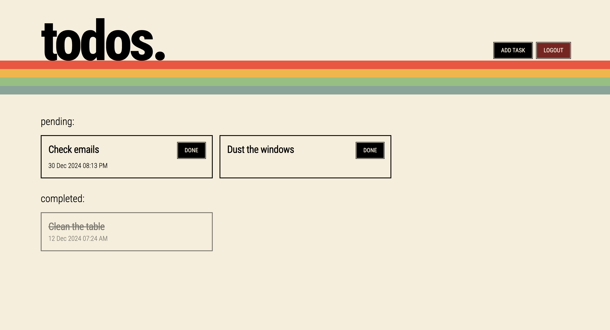
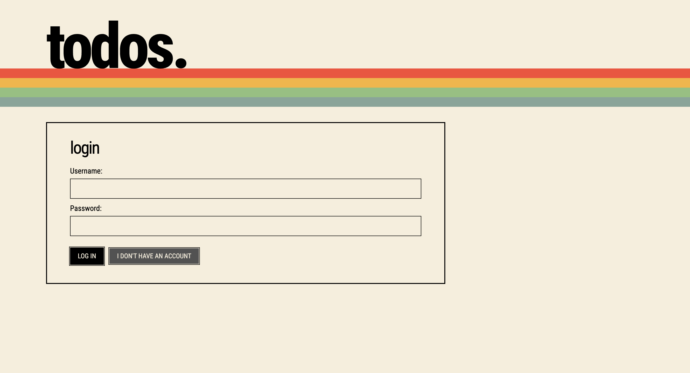

# Django Todos

A simple Django Todo application made for learning django framework. \
Interface design inspired by retro computers.

## Features
- User login & registration
- Adding due dates to tasks
- Marking a task as completed
- Maintaining history of completed tasks

## Run the app locally
> Requires a working installation of Python and Python virtual environments
1. Initialize a new virtual environment with `python -m venv myenv`
2. Use it as shell source `source myenv/bin/activate`
3. Install dependencies `pip install -r requirements.txt`
4. Start app with `python manage.py startserver`
5. Access the app at `http://127.0.0.1:8000/`

## Screenshots

Tasks Screen

Login Screen

---
Yash Jawale